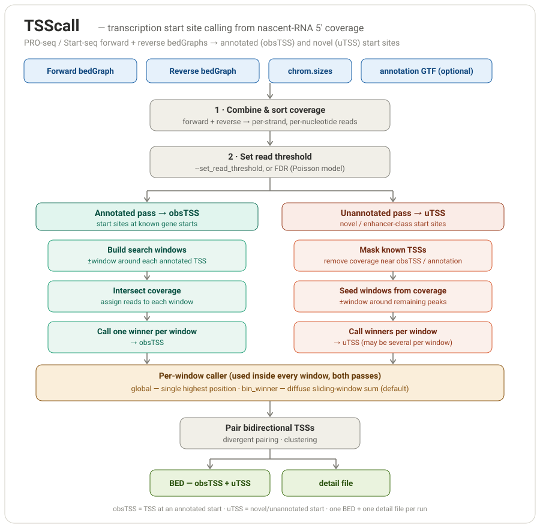

# TSScall

Call transcription start sites (TSSs) from nascent-RNA 5′ coverage — PRO-seq,
Start-seq, and related assays. Given forward and reverse single-nucleotide
coverage bedGraphs, TSScall reports start sites at annotated gene starts
(**obsTSS**) and novel/unannotated start sites (**uTSS**, e.g. enhancer-class
initiation).



## About this fork

This is a fork of [lavenderca/TSScall](https://github.com/lavenderca/TSScall)
carrying a **performance refactor** of `TSScall.py`. The calling logic and
statistics are unchanged: the refactored script produces output that is
**byte-identical** to upstream — verified by md5 on both the BED and detail
files across every calling mode, on synthetic data and on full-depth real
PRO-seq data (see [`PERFORMANCE.md`](PERFORMANCE.md)).

What the refactor buys you, at a glance, on our full-depth test dataset:

- Full-depth calling with **no pre-filtering** now runs on a single node in
  ~15–20 minutes and ~30 GB — a computation the original cannot complete
  (it exhausts 90 GB and is OOM-killed).
- Where the original does complete, the refactor is **74–306× faster** with
  identical output (e.g. 13.2 h → 2.6 min on the densest condition).

Full details, benchmarks, and the correctness argument are in
[`PERFORMANCE.md`](PERFORMANCE.md).

## Requirements

- Python 2.7 or 3.x
- [`numpy`](https://numpy.org/) (`pip install -r requirements.txt`)

> **Note:** upstream TSScall had no third-party dependencies; this fork adds
> `numpy`, which is used for the compact coverage representation and vectorized
> reductions.

## Installation

```bash
git clone https://github.com/YOURORG/TSScall.git
cd TSScall
pip install -r requirements.txt
```

## Usage

Inputs are two bedGraphs of single-nucleotide 5′ read counts (forward and
reverse strand), a chromosome-sizes file, and an output BED path. An annotation
(GTF) is optional but enables the annotated (obsTSS) pass.

```bash
python TSScall.py \
    --annotation_file annotation.gtf \
    --detail_file EXP_TSScall_detail_file \
    --set_read_threshold 8 \
    --annotation_join_distance 500 \
    --annotation_search_window 1000 \
    forward.bedGraph reverse.bedGraph chrom.sizes EXP_TSScall_output.bed
```

Positional arguments, in order: `forward.bedGraph reverse.bedGraph
chrom.sizes output.bed`.

### Common options

| Option | Meaning |
|---|---|
| `--set_read_threshold N` | Fixed calling threshold. If omitted, a threshold is chosen by the built-in FDR (Poisson) model. |
| `--annotation_file FILE` | GTF of annotated transcripts; drives the obsTSS pass. |
| `--detail_file FILE` | Per-TSS detail output (type, reads, bidirectional/cluster info). |
| `--annotation_search_window N` | Half-width of the window placed around each annotated TSS. |
| `--annotation_join_distance N` | Distance within which nearby annotated TSSs are merged. |
| `--call_method {bin_winner,global}` | Per-window caller (see diagram). `bin_winner` (default) favors diffuse coverage; `global` takes the single highest position. |

Run `python TSScall.py --help` for the complete list.

### Recommendation: do not pre-filter the input

A common workaround for the original script's memory use was to strip
low-count positions from the bedGraphs before running. **This is unnecessary
with the refactor and is lossy under `bin_winner`** — it perturbs ~1–2 % of
calls at a matched threshold and lets the pre-filter floor silently override a
lower `--set_read_threshold`. Feed full-depth bedGraphs and control the
threshold with `--set_read_threshold`. The rationale and measurements are in
[`PERFORMANCE.md`](PERFORMANCE.md#pre-filtering-is-unnecessary-and-lossy).

## Output

- **BED** — all called TSSs (obsTSS + uTSS), one feature per called start.
- **Detail file** (`--detail_file`) — per-TSS metadata: type, read count,
  bidirectional pairing, and cluster assignment.

## Preserved upstream behaviors

To guarantee byte-identical output, this fork **intentionally preserves two
pre-existing behaviors of the original** that silently drop a small amount of
uTSS signal at the very end of the sorted genome. They are documented, marked
in the code (`PRESERVED LEGACY BEHAVIOR`), and discussed with their exact scope
in [`PERFORMANCE.md`](PERFORMANCE.md#preserved-upstream-behaviors). They affect
only uTSS calls in the terminal region of the last (lexically-sorted)
chromosome; obsTSS calls are unaffected. Fixing them is a deliberate,
separate decision — doing so would (correctly) change output relative to
upstream.

## Validation & benchmarking

The [`benchmark/`](benchmark/) directory contains the SLURM harness used to
verify correctness and measure performance (original vs. refactored, across
pre-filter and threshold levels), plus the peak-overlap analyzer and the
equivalence fuzz tests that prove the two rewritten hot paths match the
original. See [`benchmark/README.md`](benchmark/README.md) and
[`benchmark/RESULTS.md`](benchmark/RESULTS.md).

## Credits

TSScall was created by Christopher Lavender, based on work by Adam Burkholder,
Integrative Bioinformatics, NIEHS. This fork adds a performance refactor by
the Nascent Transcriptomics Core.  Code was generated by Anthropic Claude Opus 4.8 in August, 2026
supervised and tested by NTC staff. The refactor preserves the peak calling logic 
of the previous version.

## License

See [`LICENSE`](LICENSE) (retained from upstream lavenderca/TSScall).
